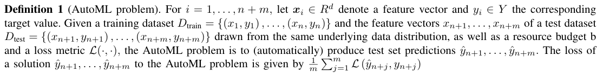

#### Introduction:

  Nowadays artificial intelligence or machine learning becomes more and more relevant in our existence, more and more fields have involved the applying of artificial intelligence. As a result, more and more people want to use machine learning algorithms to varied unrelated research fields. However, plenty of those don’t understand any machine learning algorithms, or only understand a bit basic, so as to permit such novices to quickly use artificial intelligence, for instance, to search out the best (machine learning) algorithm and suitable hyper-parameters of this algorithm for a particular research problem, without having to know the (machine learning) algorithms themselves, a research direction called “auto-machine learning” gradually attracted scientists’ eyeballs and has developed rapidly within the last ten years.

  Auto machine learning, as the name suggests, automatically selects the optimized algorithm and the corresponding hyper-parameters for a given problem and then gives out the output. Therefore it can be visually understood as a black box because people don’t know what’s within the black box, and they only need to give input and observe the output, just as those non-experts don’t know the machine learning algorithm used and also the corresponding hyper-parameters, they only have to give the data set and care about the results.

  As mentioned in \[1], every machine learning service should solve 3 fundamental problems: 1) whether and the way to preprocess the features of the dataset 2) which ml-algorithm to use on the given dataset 3) the way to set all hyper-parameters of this algorithm. So principally any automated machine learning service should be able to solve these 3 problems automatically. In other words,  AutoML service should automatically produce the test set predictions for a brand new dataset within a fixed computational budget. One formal definition of AutoML problem defined in \[1] is stated as follows:

